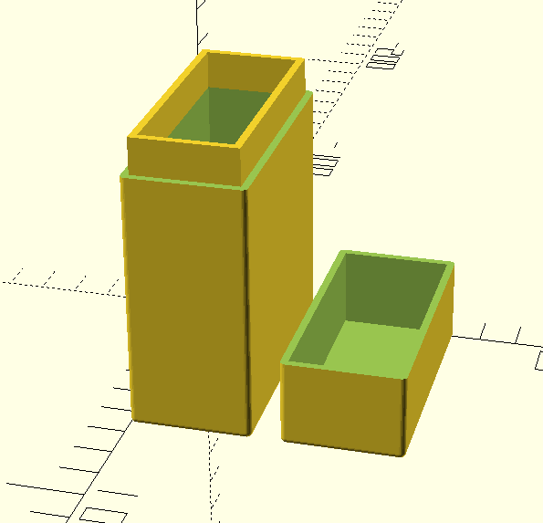

# CustomCardCase library

This library creates 3D models of custom storage cases for gaming cards (from board games, collectible card games, classic playing cards, etc.). A case can be generated for any given card or deck size.

## Library Modules

### custom_card_case_bottom(card_width, card_height, deck_depth, minimum_wall_width=2, center=true)

Generates the bottom part of the two piece case

### custom_card_case_top(card_width, card_height, deck_depth, minimum_wall_width=2, center=true)

Generates the top part of the two piece case

### Common parameters

**card_width** - the width of the type of card to be stored

**card_height** - the height of the type of card to be stored

**deck_depth** - the depth of the deck of cards to be stored

**minimum_wall_width** - the minimum thickness for the walls of the case. This may need adjusting for various materials or printer models.

**center** - will the generated model be centered on the origin?
